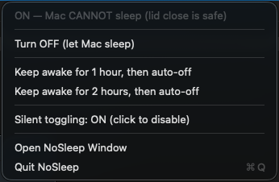
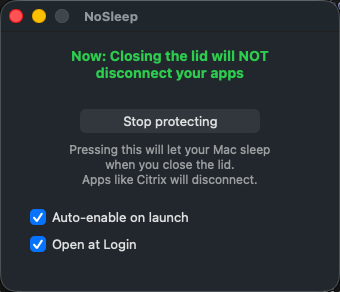

# NoSleep — Keep Your Mac Awake With the Lid Closed ☕️

**Stop your MacBook from sleeping when you shut the lid.** NoSleep is a free, lightweight macOS menu-bar app that keeps your Mac running with the lid closed, so the things you leave going overnight actually keep going: Citrix and remote-desktop sessions, SSH connections, large downloads, renders, backups, and file transfers.

No more coming back to a dead session because macOS clamshell-slept the moment you closed the screen.

<p align="center">
  
  &nbsp;&nbsp;
  
</p>

---

## Why NoSleep?

Close a MacBook's lid and macOS goes to sleep within seconds unless an external monitor is plugged in. That kills any work running in the background.

The popular trick, `caffeinate`, **does not** solve this. It prevents idle and display sleep, but it does **not** stop *clamshell* (lid-closed) sleep. The only thing that does is `pmset disablesleep`, which needs admin rights and is awkward to run by hand every time.

NoSleep wraps that in a one-click menu-bar toggle, adds a timer so you can't forget to turn it back on, and lets you opt into password-free toggling. That's it. It does one job and gets out of the way.

## Features

- ☕️ **Keeps your Mac awake with the lid closed** — the real clamshell fix, not just idle/display sleep.
- 🧭 **Lives in the menu bar** — no Dock icon, no window in your way. The icon tells you the state instantly:
  - ☕️ **ON** — your Mac stays awake (closing the lid is safe)
  - 💤 **OFF** — your Mac can sleep normally
- ⏲️ **Auto-off timer** — "keep awake for 1 or 2 hours, then turn off automatically." Perfect for a long meeting, a download, or an overnight task.
- 🔕 **Password-free mode (optional)** — approve once and never see an admin prompt again.
- 🚀 **Launch at login & auto-enable** — set it and forget it.
- 🪶 **Tiny and native** — pure Swift + AppKit, ~300 lines, no Electron, no background bloat, no telemetry, no account.

## NoSleep vs. the alternatives

| | NoSleep | `caffeinate` | Amphetamine / Caffeine |
|---|:---:|:---:|:---:|
| Keeps Mac awake **with lid closed** | ✅ | ❌ | ⚠️ (extra setup) |
| Free & open source | ✅ | ✅ | ⚠️ |
| One-click menu-bar toggle | ✅ | ❌ (CLI) | ✅ |
| Auto-off timer | ✅ | ⚠️ (manual flag) | ✅ |
| No password prompts (optional) | ✅ | ❌ | ❌ |
| Lightweight / no bloat | ✅ | ✅ | ⚠️ |

If you searched for an **Amphetamine alternative** or a **Caffeine alternative that works with the lid closed**, this is it.

## Install

Requires **macOS 13 (Ventura) or later** and the Xcode command-line tools (`xcode-select --install`).

```bash
git clone https://github.com/cefege/NoSleep.git
cd noSleep
./build.sh
cp -r build/NoSleep.app /Applications/
open /Applications/NoSleep.app
```

The ☕️/💤 icon appears in your menu bar (top-right). Click it for everything.

> NoSleep is **ad-hoc signed** (no paid Apple Developer account required). On first launch macOS may flag it as from an unidentified developer — right-click the app → **Open**, or allow it under **System Settings → Privacy & Security**.

## Usage

Click the menu-bar icon:

| Menu item | What it does |
|---|---|
| *Status line* | Live state, re-read from the system every time you open the menu |
| **Turn ON / OFF** | Keep awake / allow sleep |
| **Keep awake for 1 / 2 hours** | Turn on now, auto-revert at the shown deadline |
| **Enable silent toggling…** | One-time setup for password-free toggling |
| **Open NoSleep Window** | Settings (auto-enable on launch, open at login) |
| **Quit** | ⌘Q |

## Password-free mode

By default each toggle asks for your admin password, because flipping `pmset` requires root. To stop the prompts:

**Menu → Enable silent toggling…** → approve once.

This installs a narrowly-scoped rule at `/etc/sudoers.d/nosleep` that lets **only** `pmset -a disablesleep 0` and `pmset -a disablesleep 1` run without a password — nothing else. Click the item again to remove it. Prefer to keep zero standing privileges? Just skip this and approve the prompt each time.

## How it works

- A menu-bar `NSStatusItem` with `LSUIElement = true` (no Dock presence).
- Toggling runs `pmset -a disablesleep 0|1`: it tries passwordless `sudo -n` first, and falls back to a macOS admin prompt if silent mode isn't enabled.
- "Open at Login" uses the modern `SMAppService` API.
- A 30-second poll keeps the displayed state honest, even if you change power settings elsewhere.

## Uninstall

```bash
rm -rf /Applications/NoSleep.app
sudo rm -f /etc/sudoers.d/nosleep   # only if you enabled silent toggling
```
Then remove it from **System Settings → General → Login Items** if you added it there.

## FAQ

**Does this work without an external monitor?** Yes — that's the whole point. It keeps the Mac awake on clamshell with nothing else plugged in.

**Will it drain my battery?** Your Mac stays fully awake while ON, so it uses normal running power. Use the auto-off timer, or turn it OFF when you're done, to avoid surprises. Keep it plugged in for long sessions.

**Does it spy on me / phone home?** No. No network code, no analytics, no account. It only calls `pmset`.

**Is it safe?** It's open source — read every line in [`Sources/main.swift`](Sources/main.swift). The optional sudoers rule is scoped to exactly two commands.

## Contributing

Issues and PRs welcome. It's one Swift file; keep it small and boring.

## License

MIT — free to use, fork, and ship.

---

<sub>Keywords: keep mac awake lid closed · prevent macbook sleep when closed · macOS clamshell sleep · disable sleep mac menu bar · stop mac sleeping lid shut · Citrix disconnect MacBook lid closed · caffeinate alternative · Amphetamine alternative · Caffeine app alternative · keep SSH alive lid closed · macbook download overnight lid closed</sub>
